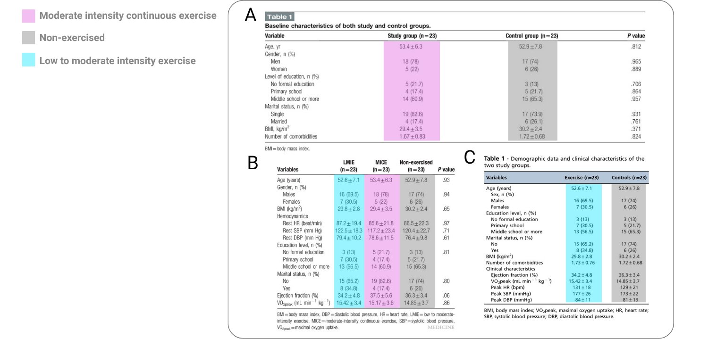
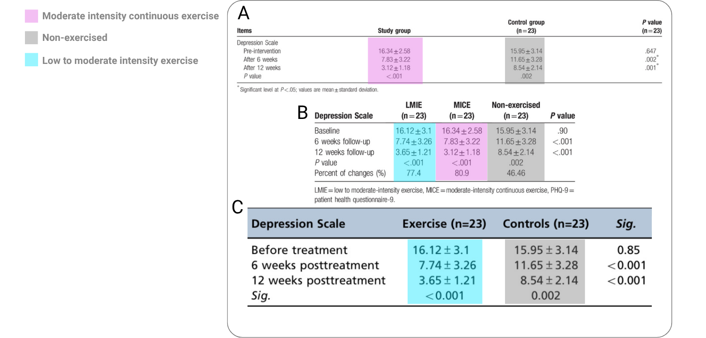

```{r}
#| include: false

source("reports/helpers/themes.R")
source("reports/helpers/functions.R")


```

\clearpage


<!-- ######################### -->
<!-- ######################### -->
<!-- START REPORT WRITING HERE -->
<!-- ######################### -->
<!-- ######################### -->


## Executive summary


### Description of audited studies

In this report, we investigate three studies: @abdelbasset2019a, @abdelbasset2019b, and @abdelbasset2019c. Each of these studies report a randomized controlled trial (RCT) on the effectiveness of moderate-low intensity exercise on depression scores in patients with Congestive Heart Disease/Failure (CHF) related depression. In each study, moderate and low intensity exercise conditions consist of a 12-week intervention with three sessions per week of walking on a treadmill until subjects reached a specified maximum heart rate. Depression was measured using the Patient Health Questionnaire 9 (PHQ-9) at baseline, 6 weeks, and 12 weeks (i.e., post-intervention) for each study. 

### Impact of audited studies

Based on an analysis of Scopus, these studies have been cited 70 times in total and 20 times by meta-analyses and reviews (see @tbl-impact). These RCTs appear as the largest effects in these meta-analyses [e.g., @banyard2025] reporting standardized mean differences over --2.9. A particularly high-impact meta-analysis with over 550 citations, @heissel2023, reported an effect of --2.91 for @abdelbasset2019a making it the third largest effect in the meta-analysis^[the two larger effects both have integrity issues which will be discussed in future reports.]. An effect of this magnitude has high leverage on the mean effect of the meta-analysis and therefore ensuring the accuracy and integrity of this effect is critical to evidence syntheses in this field.

|Study|Total| Meta-analyses & Reviews |
|:--|:-:|:-:|
|@abdelbasset2019a|35|8|
|@abdelbasset2019b|17|5|
|@abdelbasset2019c|18|7|
|**Total**|**70**|**20**|

: Citation counts for audited studies {#tbl-impact}


## Authorship and publication integrity issues

Section 1 of ACE's taxonomy of Research Integrity Violations (RIVs) concerns the *Authorship and Publication* process of these three studies. The following sections are specific Section 1 RIVs that have been found in the audited studies along with the evidence for each one.

### Duplicated data across studies {#sec-duplicated}

The three RCTs do not appear to represent three independent clinical trials. Rather, they appear to report overlapping and duplicated data from the same clinical trial.

The clearest evidence comes from the statistical tables displaying the differences between the exercise and control arms. Across the relevant articles, the baseline characteristics for these groups are identical, including age, sex distribution, BMI, ejection fraction, VO2peak, and all other clinical variables (see @fig-baseline-tables). The reported PHQ-9 outcome values are also identical across the shared arms. The exercise group is reported with the same baseline, 6-week, and 12-week PHQ-9 scores, and the control group is likewise reported with the same baseline, 6-week, and 12-week values (see @fig-results-tables).


The *Clinics* article reports a two-arm trial with 46 participants, consisting of a low-to-moderate exercise group and a control group. The later *Medicine* article reports a three-arm trial with 69 participants, reproducing the same low-to-moderate exercise and control-arm data while adding a third moderate-intensity exercise group. A separate *Medicine* article reports the same moderate-intensity exercise group as its own trial. This is consistent with duplicated publication or salami slicing, where the same underlying trial is split across multiple publications without transparent disclosure.


Accordingly, this report identifies two instances of **RIV 1.6: Duplicate Publication and Salami Slicing**, corresponding to the two smaller articles [@abdelbasset2019a; @abdelbasset2019c] whose findings are subsumed by the three-arm *Medicine* article [@abdelbasset2019b].


{#fig-baseline-tables}


{#fig-results-tables}


### Authorship-for-sale scheme {#sec-auth-for-sale}

These three publications exhibit multiple characteristics consistent with a documented publication network that has previously been linked to authorship-for-sale schemes, which is when individuals pay for their names to be added as authors on scientific papers, often produced by "paper mills".

Independent investigations by @wise2022 identified Walid Kamal Abdelbasset as a recurring member of a broader network of authors publishing across unrelated disciplines, including nanotechnology, chemistry, engineering, and aquaculture, despite Abdelbasset's primary appointment in physical therapy and rehabilitation. Multiple publications involving this network were directly matched to contemporaneous Facebook advertisements offering authorship positions for sale. For example, one publication involving Abdelbasset and members of this network titled, *Role of alloying composition on the nanomechanical behavior of amorphous nanolaminates*, was later retracted after the publisher concluded that there was sufficient evidence that several authorship positions had been purchased [@wise2022pubpeer].

Importantly, @wise2022 emphasizes that the sale of authorship shows common indicators such as implausible collaborations, abrupt increases in publication volume, recurring author networks spanning unrelated disciplines, and, where available, advertisements matching published papers. The three RCTs examined here are consistent with these characteristics.

These publications were produced during the same period in which Abdelbasset's publication output started to increase dramatically. Wise identified Abdelbasset as one of several authors exhibiting an abrupt rise in publication volume consisting of papers that were often substantively unrelated to his discipline. Wise described this pattern as the emergence of modern "Renaissance men and women," in which the same authors repeatedly appeared on papers spanning numerous unrelated scientific disciplines [@wise2022]. An analysis of Scopus showed that Abdelbasset published in fields such as mechanical properties of amorphous metallic glasses, sulfone synthesis and applications in organic chemistry, probiotic applications in aquaculture health, inequalities and means in mathematical functions, and modified atmosphere packaging for fresh produce quality. This is highly unusual for an academic specializing in physiotherapy and women's health.

Taken together, these indicators, along with the additional issues documented in what follows as well as the data duplication and salami slicing described in @sec-duplicated, warrant classifying each of the three RCTs as an instance of **RIV 1.3: Authorship for Sale and Paper Mill Activity**.


### Compromised peer review process due to self-editing {#sec-peer-review-subversion}


The published article for @abdelbasset2019a identifies Walid Kamal Abdelbasset as the editor of the same study on which he is also the first author. This represents a serious violation of publication ethics. Because an author cannot independently oversee peer review of his own manuscript, this report classifies the issue as one instance of **RIV 1.8: Peer Review Subversion**.

This self-editing issue adds additional support to the three instances of **RIV 1.3: Authorship for Sale and Paper Mill Activity** described previously in @sec-auth-for-sale. Compromised editorial handling is a known method by which paper mill and authorship-for-sale publications can enter the literature.

It is worth noting that two of the three studies [@abdelbasset2019a; @abdelbasset2019c] were both published in the journal *Medicine* where Abdelbasset is on the editorial board for physiotherapy and rehabilitation [@MedicineAbdelbasset].


### Incompatible authorship contribution statements {#sec-authorship-contributions}

The authorship contribution statements are incompatible with the conclusion that these papers report independent studies. The two heart-failure papers appear to report the same underlying trial data, but they assign materially different contributors to core research roles that should not change if the underlying study is the same.

In the two-arm *Medicine* article [@abdelbasset2019a], conceptualization is attributed only to Abdelbasset; data curation and formal analysis are attributed only to Abdelbasset and Alqahtani; funding acquisition is attributed only to Abdelbasset; and resources and software are attributed only to Alqahtani. By contrast, the later three-arm *Medicine* article assigns conceptualization to Abdelbasset, Alqahtani, and Ahmed; data curation to five authors; formal analysis to Abdelbasset, Ahmed, and Ibrahim; funding acquisition to Alqahtani, Alrawaili, Ahmed, and Ibrahim; resources only to Ibrahim; and software to Alrawaili and Elnegamy. The same reported trial cannot coherently have one set of individuals who acquired funding, curated the data, performed the analysis, supplied resources, and provided software in one article, and a different set of individuals performing those same roles in another article.

The *Clinics* article's [@abdelbasset2019c] author contribution statement assigns study design, data curation, and analysis primarily to Abdelbasset, Alqahtani, Elshehawy, Tantawy, Elnegamy, and Kamel. Several authors credited with core roles in the three-arm *Medicine* article are absent from the *Clinics* contribution statement, while several authors credited in the *Clinics* article are absent from the three-arm *Medicine* article. This is difficult to reconcile if the papers derive from the same trial data.

These incompatible contribution statements warrant three instances of **RIV 1.7: Incompatible Authorship Contribution Statements** because the three studies indicate that authorship roles were not assigned according to stable, verifiable contributions to the underlying clinical trial.


### Incompatible ethical approval numbers {#sec-ethics-approval}

The ethical approval statements also differ across the three articles. The two-arm *Medicine* article reports ethical approval number `RHPT/017/008` [@abdelbasset2019a]. The *Clinics* article reports ethical approval number `RHPT/017/009` [@abdelbasset2019c]. The three-arm *Medicine* article reports ethical approval number `RHPT/017/010` [@abdelbasset2019b].

This discrepancy is difficult to reconcile with the duplicated trial data described in @sec-duplicated. If the three articles reported three independent clinical trials, different ethical approval numbers would not necessarily be problematic. However, the articles do not appear to report independent trials. The *Clinics* article reproduces the same low-to-moderate intensity exercise and control-arm data that appear in the later three-arm *Medicine* article, while the separate two-arm *Medicine* article reports the moderate-intensity exercise comparison as its own trial. Thus, the same apparent underlying clinical trial is associated with three different ethical approval numbers.

The structure of the approval numbers suggests a common institutional or committee prefix (`RHPT`, probably referring to rehabilitation and physical therapy), a shared year or protocol field (`017`, probably corresponding to 2017), and a final sequential approval identifier (`008`, `009`, `010`). The three articles therefore do not report differently formatted versions of the same approval number. They report three consecutive but distinct approval identifiers.

This inconsistency is especially concerning because the reported trial is within a highly vulnerable population. The participants had chronic heart failure, were assigned to exercise interventions, and had high baseline PHQ-9 scores indicating substantial depressive symptom burden. In such a context, clear ethical approval is particularly important. Without clarification, the presence of three different approval numbers for overlapping trial data raises serious concerns about the adequacy of the ethical oversight.

Accordingly, without further clarification by the authors this report classifies the issue as three instances of **RIV 3.3: Ethics Approval Anomalies** because the ethical approval information is not reconcilable with the apparent reuse of the same underlying trial data across multiple publications.


## Impossible data and extreme treatment effects


### Impossible means and standard deviations {#sec-grimmer}

The results table in each of the three RCTs show means and SDs of PHQ-9 scores across each group for the baseline, 6-week, and 12-week timepoints. Since PHQ-9 is scored as a sum of item responses and therefore the resulting total score is on an integer scale. Using the GRIM/MER test [@grim; @grimmer], we can demonstrate that the means and standard deviations are impossible to be produced given the sample size. In all three RCTs, it is made clear that each group has 23 patients and none of them were lost to follow-ups at 6 or 12 weeks. @tbl-grimmer shows the extracted PHQ-9 mean, standard deviation, and sample size values for each of the three groups (LMIE, MICE, Non-Exercised) and the three time-points (baseline, 6-weeks, 12-weeks), making $3\times 3 = 9$ testable GRIMMER cases. The results of the GRIMMER tests can be seen in @tbl-grimmer. Since @abdelbasset2019b reports all groups in their results, we extract the summary statistics from the corresponding table (panel B of @fig-results-tables). 

The results displayed in @tbl-grimmer show that of the nine GRIMMER cases, seven of them are inconsistent. Five of the seven cases that are inconsistent have means that can not possibly be calculated from a real data set (i.e., GRIMMER inconsistent) and the remaining two cases show standard deviations that can not come from a possible data set (i.e., GRIMMER inconsistent).


```{r}
#| label: tbl-grimmer
#| tbl-cap: "GRIMMER consistency for reported PHQ-9 means and standard deviations."


library(dplyr)
library(tibble)
library(scrutiny)
library(tinytable)


phq9_grimmer_data <- tribble(
  ~Timepoint, ~Group, ~Mean, ~SD, ~n,
  "Baseline", "LMIE", "16.12", "3.10", 23,
  "Baseline", "MICE", "16.34", "2.58", 23,
  "Baseline", "Control", "15.95", "3.14", 23,
  "6 weeks", "LMIE", "7.74", "3.26", 23,
  "6 weeks", "MICE", "7.83", "3.22", 23,
  "6 weeks", "Control", "11.65", "3.28", 23,
  "12 weeks", "LMIE", "3.65", "1.21", 23,
  "12 weeks", "MICE", "3.12", "1.18", 23,
  "12 weeks", "Control", "8.54", "2.14", 23
)

grimmer_tt(
  data = phq9_grimmer_data,
  mean_col = Mean,
  sd_col = SD,
  n_col = n,
  note = "Note. SD = standard deviation, n = sample size, LMIE = Low to Moderate Intensity Exercise, MICE = Moderate-Intensity Continuous Exercise, Control = Non-exercised",
  id_cols = c("Timepoint", "Group"),
  items = 1
)

```


One possible explanation for the GRIMMER failures is that the reported group sample size of $n = 23$ was incorrect. This explanation is unlikely. The group sample sizes are reported consistently within the articles, and the same $n = 23$ group sizes appears across the study articles. Nevertheless, we evaluated whether the inconsistencies could be resolved by assuming smaller analyzed sample sizes, such as might occur if some participants were excluded from the final analysis.

To test this, we recalculated GRIMMER consistency for every candidate group sample size from $n = 2$ through the reported $n = 23$. For each group and each candidate sample size, @fig-grimmer-n shows how many of the three reported PHQ-9 mean-SD pairs (for each timepoint) were GRIMMER-consistent. A fully plausible sample-size correction would require all three timepoints within a group to become consistent at the same candidate sample size. This does not occur for any group at any sample size below $n = 23$.

Thus, the GRIMMER failures are not resolved by assuming that the true sample sizes were smaller than reported. The inconsistencies instead persist across the possible smaller group sizes. 

This is classified as seven instances of **RIV 2.2: Statistical Inconsistencies and Impossible Data Sets**, one for each failed GRIMMER test.


```{r}
#| label: fig-grimmer-n
#| fig-cap: "GRIMMER consistency across candidate sample sizes. Black tiles indicate PHQ-9 mean-SD pairs that are GRIMMER-consistent; light grey tiles indicate inconsistent pairs. No group has any candidate sample size below $n = 23$ for which all three timepoints are simultaneously consistent."
#| fig-width: 8
#| fig-height: 5

library(dplyr)
library(tidyr)
library(scrutiny)
library(ggplot2)

expanded_grimmer <- phq9_grimmer_data |>
  select(-n) |>
  tidyr::crossing(candidate_n = 2:23)

grimmer_results_n <- expanded_grimmer |>
  scrutiny::grimmer_map(
    x = Mean,
    sd = SD,
    n = candidate_n,
    items = 1
  ) |>
  dplyr::transmute(
    consistent = consistency
  )

checked_grimmer <- expanded_grimmer |>
  dplyr::bind_cols(grimmer_results_n)

grimmer_counts <- checked_grimmer |>
  dplyr::group_by(Group, candidate_n) |>
  dplyr::summarise(
    n_consistent = sum(consistent),
    .groups = "drop"
  )

grimmer_tiles <- grimmer_counts |>
  tidyr::crossing(case_count = 1:3) |>
  dplyr::mutate(
    Status = dplyr::if_else(
      case_count <= n_consistent,
      "Consistent",
      "Not consistent"
    ),
    Group = factor(
      Group,
      levels = c("LMIE", "MICE", "Non-exercised")
    )
  )

ggplot(
  grimmer_tiles,
  aes(x = candidate_n, y = case_count, fill = Status)
) +
  geom_tile(
    color = "white",
    linewidth = 0.45,
    width = 0.95,
    height = 0.95
  ) +
  facet_grid(Group ~ .) +
  scale_fill_manual(
    values = c(
      "Consistent" = "black",
      "Not consistent" = "grey85"
    )
  ) +
  scale_x_continuous(
    breaks = 2:23,
    expand = c(0, 0)
  ) +
  scale_y_continuous(
    breaks = 0:3,
    limits = c(0, 3.5),
    expand = c(0, 0)
  ) +
  labs(
    x = "Candidate sample size",
    y = "Number of consistent cases",
    fill = NULL
  ) +
  theme_minimal(base_size = 12) +
  theme(
    panel.grid = element_blank(),
    strip.text = element_text(face = "bold", color = ace_text),
    axis.text.x = element_text(
      color = ace_text,
      angle = 90,
      vjust = 0.5,
      hjust = 1
    ),
    axis.text.y = element_text(color = ace_text),
    axis.title = element_text(color = ace_text),
    axis.ticks = element_line(color = ace_axis),
    axis.line = element_line(color = ace_axis),
    legend.position = "top",
    legend.text = element_text(color = ace_text),
    legend.title = element_blank()
  )
```


### Extreme treatment effects {#sec-extreme-effects}

The reported PHQ-9 outcomes imply extremely large treatment effects. In meta-analyses that include at least one of the three Abdelbasset studies, the Abdelbasset effect is consistently among the largest effects in the meta-analysis. For example, see the meta-analyses by @bricca2020 and @banyard2025. Across these meta-analyses, the reported effects are generally near --2.90, with some variation depending on the estimation procedure and the treatment arm used for the comparison.

Using the values reported in the three-arm article, this report estimates the 12-week between-group standardized mean differences as --2.81 for the low-to-moderate intensity exercise group and --3.14 for the moderate-intensity continuous exercise group, each compared with the non-exercised control group. These values imply that, after 12 weeks, the exercise groups had PHQ-9 scores approximately three standard deviations lower than the control group.

These effects are implausibly large in the context of clinical trials. According to the benchmarks proposed by @sawilowsky2009, standardized mean differences above 0.80 are considered large, values above 1.20 are considered very large, and values above 2.00 are considered huge. The reported Abdelbasset effects exceed even the “huge” benchmark by approximately one entire standard deviation. Although effect-size benchmarks are only descriptive heuristics and cannot by themselves establish an error, effects of this magnitude warrant explanation, particularly when combined with the duplicated publication pattern (@sec-duplicated), GRIMMER failures (@sec-grimmer), and other internal inconsistencies documented in this report.

This warrants two instances of **RIV 2.1: Anomalies and Extreme Values** for the two extreme between-study effects.


### Surprising level of treatment compliance

The three Abdelbasset articles report that all randomized participants were retained through the 12-week follow-up. In all three arms of the underlying trial, 69 patients were randomized into three groups of 23, and all three groups were analyzed at follow-up [@abdelbasset2019b]. Thus, the demands of the intervention, the reported trial record implies zero attrition.

This is not impossible, but it is surprising. The participants were patients with congestive heart failure and moderate-severe depressive symptoms. The intervention was not passive. Participants assigned to exercise were expected to complete treadmill exercise three times per week for 12 consecutive weeks, with intensity adjusted according to maximum heart rate. A study population with heart failure and depression would ordinarily be expected to include at least some missed complications, withdrawals, or incomplete follow-up assessments.

The concern is strengthened by the limited reporting of adherence information. The articles state that the exercise groups were supervised and received feedback to adjust intensity, but they do not provide session attendance, missed-session counts, adherence percentages, reasons for missed visits, adverse-event monitoring by group, or the number of participants who completed the full exercise regimen.

Perfect retention is another irregularity that warrants scrutiny. The absence of attrition is difficult to evaluate independently because the articles do not provide the participant-level adherence or follow-up information needed to verify the reported trial conduct.


## Conclusion {#sec-conclusion}

The three Abdelbasset et al. articles audited in this report contain multiple anomalies and errors across publication, authorship, ethics approval, and statistical reporting. The articles appear to report overlapping trial arms from the same underlying clinical trial across multiple publications, without transparent disclosure that the articles are linked in any way. This pattern supports two instances of **RIV 1.6: Duplicate Publication and Salami Slicing**.

The publication record also contains serious authorship and editorial concerns. The studies are connected to an author network previously associated with authorship-for-sale concerns, and one article identifies Abdelbasset as both first author and editor of the same manuscript. The contribution statements across the articles are also incompatible, assigning different individuals to core study roles that should be the same if the same clinical trial is being reported. These issues support instances of **RIV 1.3: Authorship for Sale and Paper Mill Activity**, **RIV 1.8: Peer Review Subversion**, and **RIV 1.7: Incompatible Authorship Contribution Statements**.

The ethical approval is also not reconcilable with the duplication of trial data. The three articles report three distinct ethical approval numbers, despite reporting overlapping arms from the same clinical trial. This is especially concerning because the reported trial population was highly vulnerable: participants had chronic heart failure, were assigned to exercise interventions, and had high baseline depressive symptoms. In this context, clear ethical oversight and approval is essential. Without further clarification, the differing approval numbers warrant three instances of **RIV 3.3: Ethics Approval Anomalies**.

The statistical evidence raises severe concerns about the integrity of the data. The summary statistics for the PHQ-9 outcome consistently fail GRIMMER checks, indicating that the reported summary statistics could not have been produced by a real data set (this warrants seven instances of **RIV 2.2: Statistical Inconsistencies and Impossible Data Sets**). These failures are not resolved by when allowing for possible unreported list-wise deletion of some individuals from the data set. The reported outcomes also imply extremely large between-group treatment effects, approximately three standard deviations in magnitude at 12 weeks, which are far beyond conventional benchmarks for large treatment effects and appear as highly influential outliers in later meta-analyses. Due to the massive effect size observed in the articles it warrants two instances of **RIV 2.1: Anomalies and Extreme Values**.

Taken together, these findings substantially undermine the reliability and integrity of the three reported RCTs. This report cannot verify that the reported trial data correspond to an actual conducted randomized controlled trial as described in the publications. The combination of duplicated trial arms, incompatible authorship roles, inconsistent ethical approval identifiers, impossible descriptive statistics, and extreme treatment effects leaves the provenance of the reported patient data unresolved.

We believe that the appropriate editorial action is *retraction*. The journals that published these articles, *Medicine* and *Clinics*, should retract all three articles because they contain duplicated trial arms, incompatible ethical approval identifiers, incompatible authorship contribution statements, compromised editorial handling, impossible PHQ-9 results, extreme treatment effects that have influenced later meta-analyses, and is potentially a product of a well-documented authorship-for-sale publication mill. These are mutually reinforcing failures that undermine the integrity and evidentiary value of the reported clinical trial.

Until retractions are issued, meta-analysts, guideline developers, and readers should treat the three studies as unreliable and exclude them from evidence syntheses.


| RIV | Title | Instances | Section |
|:--|:-----------|:-:|:---|
| **RIV 1.3** | Authorship for Sale and Paper Mill Activity | 3 | @sec-auth-for-sale |
| **RIV 1.6** | Duplicate Publication and Salami Slicing | 2 | @sec-duplicated |
| **RIV 1.7** | Incompatible Authorship Contribution Statements | 3 | @sec-authorship-contributions |
| **RIV 1.8** | Peer Review Subversion | 1 | @sec-peer-review-subversion |
| **RIV 2.1** | Anomalies and Extreme Values | 2 | @sec-extreme-effects |
| **RIV 2.2** | Statistical Inconsistencies and Impossible Data Sets | 7 | @sec-grimmer |
| **RIV 3.3** | Ethics Approval Anomalies | 3 | @sec-ethics-approval |
| ***Total*** |  | ***21*** |  |

: Summary of Research Integrity Violations identified across the audited Abdelbasset et al. studies {#tbl-riv-summary}

\clearpage

## References {.unnumbered}


